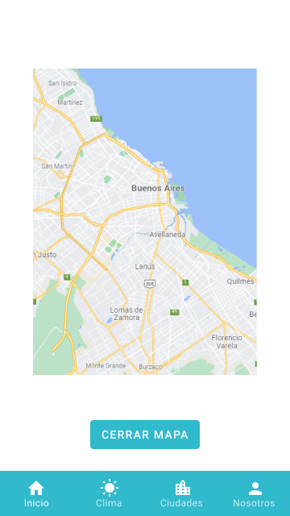

# App-Clima-IBM

## Importante
- Puedes clonar el repositorio y ejecutar el comando "npm install" para instalar las librerias requeridas.
- Por cuestiones de seguridad, la key utilizada para la API de openweathermap no se incluye en el repositorio. La misma se puede añadir en el archivo .env con el nombre API_KEY.
- Hemos desarrollado un MVP, el cual se podría mejorar por ejemplo con los siguientes cambios:
    - Utilizar otra API para obtener el clima que nos permita obtener un listado de ciudades y así evitar cargar el JSON que utilizamos, o pasar a una cuenta de pago en la API actual.
    - Al ingresar en la pantalla de Clima sin antes haber elegido una ciudad, se podría añadir la opción de que el dispositivo le solicite al usuario permisos para acceder a la ubicación actual y mostrar el clima en dicha ubicación.
    - Para minimizar las consultas a la API y mantener actualizada toda la información que se muestra en la app, podríamos realizar las mismas solo en la pantalla de Clima al seleccionar la card de una ciudad que se quiera en la pantalla de Ciudades y guardar de esos datos en una base de datos o de forma local para actualizar las card. Otra opción podría ser tener un botón dentro de la pantalla de Ciudades para actualizar la información.

## Detalles sobre sistemas operativos
- Al probar la app en dispositivos IOS nos hemos encontrado con un problema al utilizar AsyncStorage, el cual investigamos y nos encontramos con que es un problema de compatibilidad con las versiones actuales de AsyncStorage.
En dispositivos Android no existe dicho problema y funciona de forma correcta.
- El mapa donde mostramos la ciudad seleccionada no funciona cuando se hacen pruebas en el modo web, pero sí en dispositivos móviles como debe ser.

## Wireframes

## Mockups

[Ver archivos en Figma](https://www.figma.com/file/PS6r0dRUXhkTrHi43OYEG5/App-Clima-IBM)

## Persona Canva

